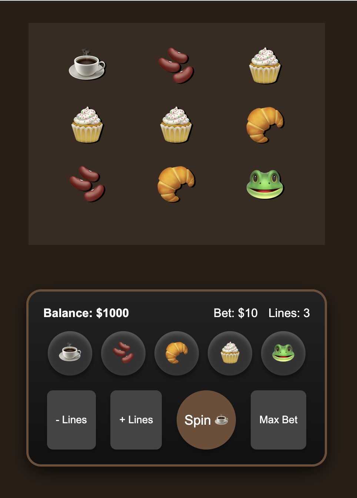

# ☕ Coffee Break Slots: High-Performance Casino Slots Game

A sophisticated slot machine prototype developed with **PixiJS** and **GSAP**. This project demonstrates core iGaming development principles including masked rendering, dynamic payline calculation, and high-fidelity motion aesthetics.



## 🕹️ Technical Highlights

* **Optimized Rendering:** Built on **PixiJS (WebGL)** to ensure 60FPS performance, critical for maintaining player engagement and "game feel."
* **Procedural Animation:** Utilizes **GSAP (GreenSock)** for physics-based reel behavior. Implements `back.out` easing to simulate mechanical weight and anticipation.
* **Advanced Game Logic:**
    * **Wild Symbol Mechanics:** Integrated `🐸` Wild logic that dynamically substitutes symbols to maximize win probability.
    * **Real-time Payline Calculation:** A robust algorithm that identifies 2-of-a-kind and 3-of-a-kind matches across horizontal vectors.
    * **Dynamic UI Feedback:** Real-time visual feedback via procedurally drawn paylines and symbol scaling animations.
* **Asset Masking:** Professional-grade `PIXI.Graphics` masking to manage sprite visibility, ensuring a clean "window" effect within the viewport.

## 🛠️ Industry Tech Stack

| Component | Technology | Purpose |
| :--- | :--- | :--- |
| **Engine** | PixiJS | High-performance 2D WebGL rendering |
| **Animation** | GSAP | Mathematical easing and sequence control |
| **Language** | ES6+ JavaScript | Modular, maintainable game logic |
| **Architecture** | Container-Based | Scalable sprite management for easy skinning |

## 📂 Architecture

```text
├── assets/
│   └── screenshot.png   # Visual documentation
├── index.html           # DOM Entry point & PIXI Container
├── main.js            # Core Engine (Logic, Math, Win-Check)
└── style.css            # Game-center positioning & UI layout