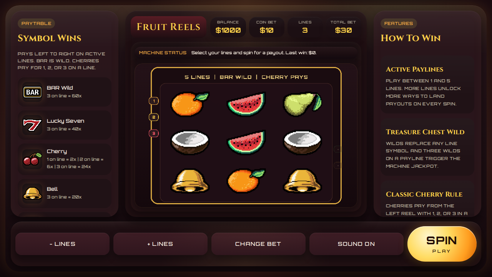

# Fruit Reels Slots

[](https://github.com/JohannesL2/slot-game/actions/workflows/ci.yml)

Fruit Reels is a browser slot machine built with **PixiJS** and **GSAP**. It uses a **pixel-art spritesheet** for symbols (orange, pear, watermelon, BAR wild, coconut, seven, bell, cherry), a warm fruit-and-gold cabinet UI, and classic-style **line wins** with cherry pays for 1, 2, or 3 on a line.



## Portfolio Note

This project was developed with my own direction and final decision-making, using an LLM coding assistant as a collaborative implementation tool for parts of the UI, gameplay logic, and polish work.

## Highlights

- Casino-style presentation with a responsive machine cabinet, compact HUD, paytable, and control deck.
- 3×3 reel window with up to **5 active paylines**.
- **Spritesheet-driven symbols** (`assets/spritesheet.json` + `assets/spritesheet.png`) with nearest-neighbor scaling for crisp pixel art.
- Weighted symbol generation for slot-like outcomes.
- **Classic line evaluation:** pays left to right; **cherry** pays for 1 / 2 / 3 on a line; other symbols pay on **3 of a kind**; **BAR** substitutes as wild.
- Animated paylines, burst particles, cabinet pulse, and win callouts.
- In-browser sound effects for spin, reel stops, and win states.
- Responsive layout so reels and controls stay usable on desktop and smaller screens.

## Tech Stack

| Component | Technology | Purpose |
| :--- | :--- | :--- |
| Rendering | PixiJS | Reel rendering, spritesheet textures, cabinet effects, particles |
| Animation | GSAP | Reel motion, UI feedback, win effects |
| Language | JavaScript (ES Modules) | Game logic and interaction flow |
| Styling | CSS | Responsive layout and warm fruit-slot visual design |

## Game Features

- **Active paylines:** Play from 1 to 5 lines; total bet scales with coin bet × lines.
- **Coin bet control:** Cycle bet size from the control deck.
- **BAR wild:** Substitutes for line symbols; three BARs on a line pay the top line multiplier.
- **Cherry rule:** Cherries pay when 1, 2, or 3 appear from the left on an active payline.
- **Win feedback:** Winning lines, symbol pulses, count-up win badge, and celebration overlays.

## Credits
"Pixel art slot machine", by Vircon32 (Carra). Published at OpenGameArt under license CC-BY 4.0.
- **Source:** [OpenGameArt](https://opengameart.org/)

## Project Structure

```text
├── assets/             # Spritesheet (JSON + PNG), screenshot, etc.
├── index.html          # App shell and slot machine UI structure
├── main.js             # Pixi scene, reel logic, payouts, effects, sound
├── style.css           # Responsive cabinet layout and visual styling
└── readme.md           # Project documentation
```

## Running Locally

Because this is a static browser project, you can run it with any simple local server. For example:

```bash
python3 -m http.server
```

Then open the local address in your browser and load `index.html`.
